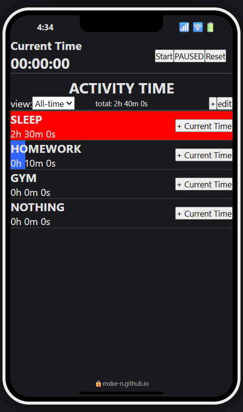

  <ul style="list-style: none">
    

      <h1><a href="https://mxke-n.github.io/react-day-tracker/">REACT-DAY-TRACKER</a></h1>
    

  </ul>

<i>Master your time, elevate your productivity today!</i>

  
  
  

<i>Built with the tools and technologies:</i>

  
  
  
  
  
  
  

 

  

--- 
## 📝 Overview

**react-day-tracker** is a robust time management tool designed to help users effectively monitor and manage their daily activities, enhancing productivity and mindfulness.

### Why react-day-tracker?

This project empowers individuals to make informed decisions about their schedules through insightful time allocation. The core features include:

- ⏱️ **Time Tracking**: Effortlessly monitor your time allocation for various activities.
- 📋 **Activity Management**: Add, edit, and delete activities with ease, ensuring flexibility in tracking.
- ⌚ **Stopwatch Functionality**: Real-time stopwatch for precise tracking of your tasks.
- 📱 **Responsive Design**: A mobile-friendly interface that enhances user experience across devices.
- 💾 **Persistent Storage**: Local storage integration keeps your data safe across sessions.
- 🧩 **User-Friendly Interface**: Intuitive components for seamless navigation and interaction.
